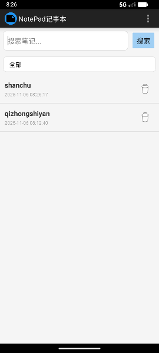
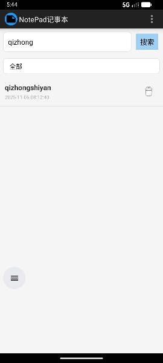
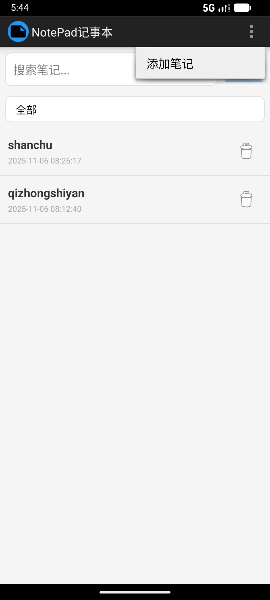
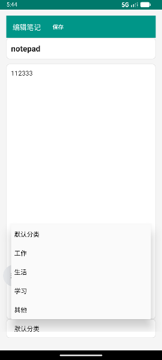
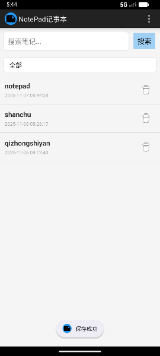
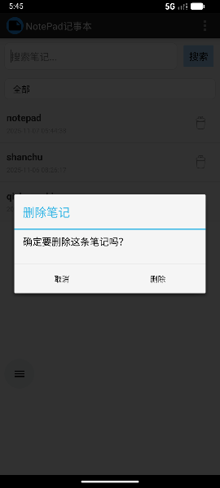
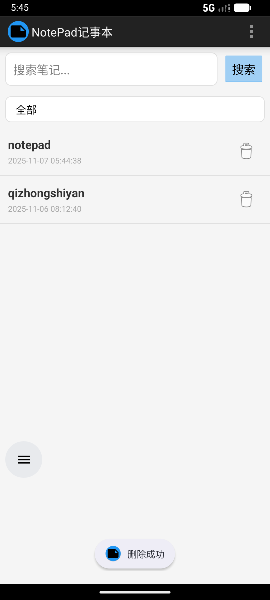
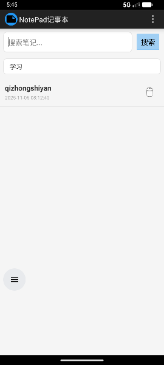
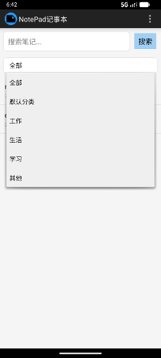

---

# MyNotePad 项目功能说明

## 一. 项目设计思路

1. **核心目标**：打造一个轻量化、功能实用的记事本应用，重点解决用户日常记录的便捷性和管理效率问题。
2. **主要功能模块**：
    - **基础功能**：实现笔记的创建、编辑、删除等基本操作。
    - **时间显示**：记录笔记的创建时间，帮助用户按时间梳理信息。
    - **快速检索**：支持关键字搜索，提升笔记查询效率。
    - **分类管理（扩展）**：通过对笔记分类分组，优化笔记管理逻辑。
    - **个性化界面（扩展）**：提供主题切换功能，增强用户体验。
3. **用户需求分析**：
    - 用户希望快速记录信息，避免复杂交互。
    - 笔记数量较多时需要高效检索和分类功能。
    - 界面风格需简洁清晰并具备一定的美化选项。
4. **技术选型与实现**：
    - 数据存储：使用 SQLite 数据库保存笔记数据。
    - 界面交互：基于 Android 原生 UI 元件实现动态布局与功能绑定。
    - 模块化开发：将功能拆分为独立模块，易于维护和扩展。

---

## 二. 项目功能实现

### 1. **时间戳显示**
- **功能描述**：在笔记列表中直观展示每条笔记的创建时间，便于用户查看记录时间。
- **实现思路**：
    - 在数据库中保存每条笔记的创建时间戳。
    - 使用工具类将时间戳转换为标准时间格式显示在笔记列表中。
- **核心代码**：
 
  ```java
  // 格式化时间戳并显示
  @Override
  public void bindView(View view, Context context, Cursor cursor) {
      super.bindView(view, context, cursor);
      // 从Cursor获取时间戳
      @SuppressLint("Range") long time = cursor.getLong(cursor.getColumnIndex(NotePad.Notes.COLUMN_NAME_CREATED_TIME));
      // 转换为标准时间格式
      String timeStr = time <= 0 ? "未知时间" :
              new SimpleDateFormat("yyyy-MM-dd HH:mm:ss", Locale.CHINA).format(new Date(time));
      ((TextView) view.findViewById(R.id.tv_note_timestamp)).setText(timeStr);
  }
  ```
- **效果展示**：
    - 笔记列表每条记录下方显示对应时间，清晰明确。

**截图展示**：  


---

### 2. **笔记查询功能**
- **功能描述**：用户可通过标题或内容关键字搜索，快速定位目标笔记。
- **实现思路**：
    - 在笔记适配器中添加动态过滤逻辑，根据用户输入实时刷新结果。
    - 搜索框绑定监听器，捕捉输入内容并触发适配器搜索方法。
- **核心代码**：
  ```java
    // 执行搜索逻辑
  private void performSearch() {
      String keyword = etSearch.getText().toString().trim();
      Spinner spinnerCategory = findViewById(R.id.spinner_category);
      String selectedCategory = (String) spinnerCategory.getSelectedItem();
      loadNotesWithFilter(keyword, selectedCategory.equals("全部") ? null : selectedCategory);
  }
  
  // 带筛选条件的笔记查询
  private void loadNotesWithFilter(String keyword, String category) {
      if (cursor != null && !cursor.isClosed()) {
          cursor.close();
      }

    StringBuilder selection = new StringBuilder();
    ArrayList<String> selectionArgs = new ArrayList<>();

    // 关键字筛选（标题或内容包含关键字）
    if (!TextUtils.isEmpty(keyword)) {
        selection.append("(")
                .append(NotePad.Notes.COLUMN_NAME_TITLE).append(" LIKE ? OR ")
                .append(NotePad.Notes.COLUMN_NAME_NOTE).append(" LIKE ?)");
        selectionArgs.add("%" + keyword + "%");
        selectionArgs.add("%" + keyword + "%");
    }

    // 分类筛选
    if (!TextUtils.isEmpty(category)) {
        if (selection.length() > 0) {
            selection.append(" AND ");
        }
        selection.append(NotePad.Notes.COLUMN_NAME_CATEGORY).append(" = ?");
        selectionArgs.add(category);
    }

    // 执行查询并更新适配器
    cursor = getContentResolver().query(
            NotePad.Notes.CONTENT_URI,
            PROJECTION,
            selection.length() > 0 ? selection.toString() : null,
            selectionArgs.size() > 0 ? selectionArgs.toArray(new String[0]) : null,
            NotePad.Notes.DEFAULT_SORT_ORDER
    );

    adapter.changeCursor(cursor);
  }
    ```
- **效果展示**：
    - 在搜索框中输入关键字，列表动态更新显示符合条件的笔记。

**截图展示**：  


---

### 3. ** 基础笔记操作 **
- **功能描述**：支持笔记的创建、编辑和删除，满足用户记录信息的核心需求。
- **实现思路**：
    - 通过 NoteEditor 活动实现笔记的创建和编辑，通过 NotesList 活动展示笔记列表并支持删除操作。
    - 使用 ContentProvider 封装数据操作，实现数据的插入、更新和删除，解耦数据层与 UI 层。
- **核心代码**：
  ```java
     // 保存笔记（创建或更新）
  private void saveNote() {
      String title = etTitle.getText().toString().trim();
      String content = etContent.getText().toString().trim();

      if (title.isEmpty()) {
          Toast.makeText(this, "标题不能为空", Toast.LENGTH_SHORT).show();
          return;
      }

      ContentValues values = new ContentValues();
      values.put(NotePad.Notes.COLUMN_NAME_TITLE, title);
      values.put(NotePad.Notes.COLUMN_NAME_NOTE, content);
      values.put(NotePad.Notes.COLUMN_NAME_CATEGORY, spinnerCategory.getSelectedItem().toString());
  
      if (currentUri == null) {
          // 新增笔记，添加创建时间
          values.put(NotePad.Notes.COLUMN_NAME_CREATED_TIME, System.currentTimeMillis());
          currentUri = getContentResolver().insert(NotePad.Notes.CONTENT_URI, values);
      } else {
          // 更新已有笔记
          getContentResolver().update(currentUri, values, null, null);
      }
  
      getContentResolver().notifyChange(NotePad.Notes.CONTENT_URI, null);
      finish();
  }
  
    // 删除笔记
  private void deleteNote() {
      new AlertDialog.Builder(this)
                .setTitle("删除笔记")
                .setMessage("确定要删除这条笔记吗？")
                .setPositiveButton("删除", (dialog, which) -> {
                    if (currentUri != null) {
                        int rowsDeleted = getContentResolver().delete(currentUri, null, null);
                        if (rowsDeleted > 0) {
                            getContentResolver().notifyChange(NotePad.Notes.CONTENT_URI, null);
                            finish();
                        }
                    }
                })
                .setNegativeButton("取消", null)
                .show();
  }
    ```

- **效果展示**：
    - 用户可通过点击 "添加笔记" 进入编辑界面，输入标题和内容后保存。
    - 长按列表项或点击编辑页菜单可删除笔记，删除前有确认提示。

**截图展示**：  






---

### 4. **笔记分类功能（扩展）**
- **功能描述**：功能描述：支持为笔记添加分类标签（如默认分类、工作、生活等），并可按分类筛选笔记。
- **实现思路**：
    -数据库表中新增 category 字段，存储笔记所属分类。
    -编辑界面添加分类选择下拉框（Spinner），允许用户为笔记选择分类。
    -列表页添加分类筛选下拉框，根据选择的分类过滤显示对应的笔记。
- **核心代码**：
   ```java
      // 编辑页初始化分类选择器
  ArrayAdapter<String> categoryAdapter = new ArrayAdapter<>(this,
          android.R.layout.simple_spinner_item, categories);
  categoryAdapter.setDropDownViewResource(android.R.layout.simple_spinner_dropdown_item);
  spinnerCategory.setAdapter(categoryAdapter);
  
  // 列表页分类筛选监听
  spinnerCategory.setOnItemSelectedListener(new AdapterView.OnItemSelectedListener() {
      @Override
      public void onItemSelected(AdapterView<?> parent, View view, int position, long id) {
          String selectedCategory = (String) parent.getItemAtPosition(position);
          loadNotesWithFilter(etSearch.getText().toString().trim(),
                  selectedCategory.equals("全部") ? null : selectedCategory);
      }
      @Override
      public void onNothingSelected(AdapterView<?> parent) {}
  });
    ```
- **效果展示**：
    - 用户可为每条笔记选择分类，并通过筛选器查看同一分类下的所有笔记。

**截图展示**：  




---

## 三. 关键技术细节
1. **数据存储**：使用 SQLite 数据库存储笔记数据，通过 NotePadProvider 类实现 ContentProvider 接口，封装数据的 CRUD 操作，确保数据访问的安全性和一致性。
2. **列表优化**：采用 SimpleCursorAdapter 绑定数据与列表项，通过 Cursor 实现数据的懒加载，提升列表滚动性能。
3. **实时更新**：通过 ContentResolver.notifyChange() 方法，在数据发生变化时通知列表更新，保证 UI 与数据的同步。
4. **界面交互**：通过监听 Spinner 选择事件、搜索框输入事件等，实现界面的动态响应，提升用户体验。
   
---

## 四. 项目亮点与扩展方向

### 1. 项目亮点
- **功能完整**：覆盖笔记管理的核心需求，包括创建、编辑、删除、搜索和分类。
- **操作简洁**：界面设计直观，用户可快速上手，专注于内容记录而非操作学习。
- **响应迅速**：通过优化查询逻辑和列表刷新机制，确保操作的即时反馈。

### 2. 后续优化方向
- **增加修改时间**：记录笔记的最后修改时间，更准确反映笔记的更新状态。
- **支持富文本**：允许用户设置字体样式、插入图片等，增强笔记的表现力。
- **数据备份**：添加导出 / 导入功能，支持笔记数据的备份与恢复。
- **标签功能**：在分类基础上增加标签属性，支持多维度的笔记管理。

